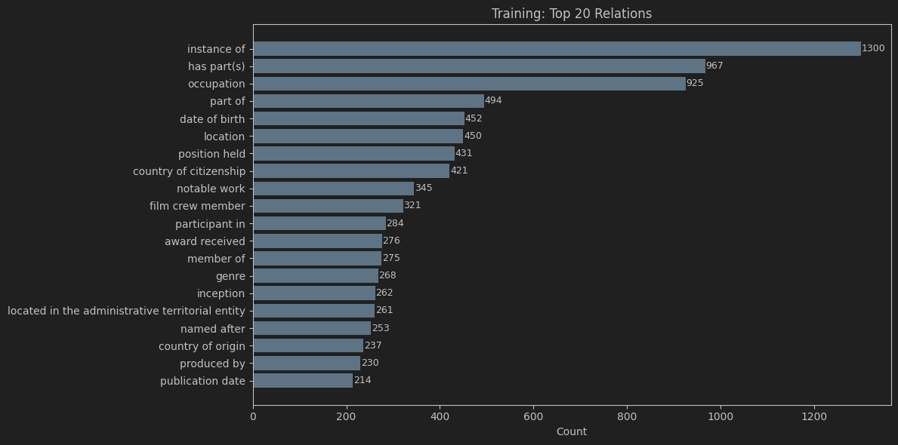
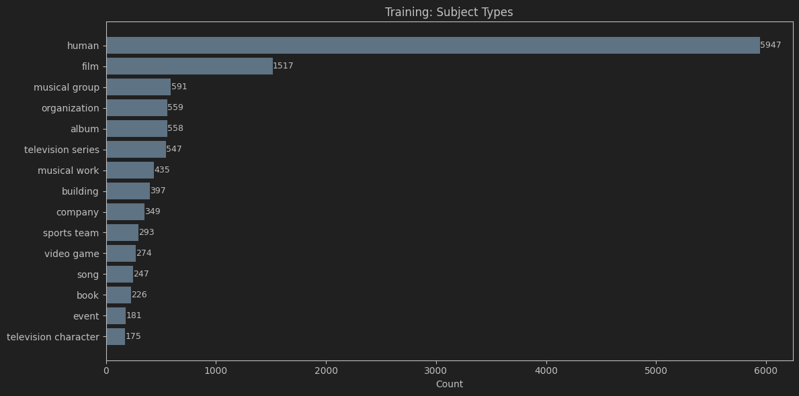
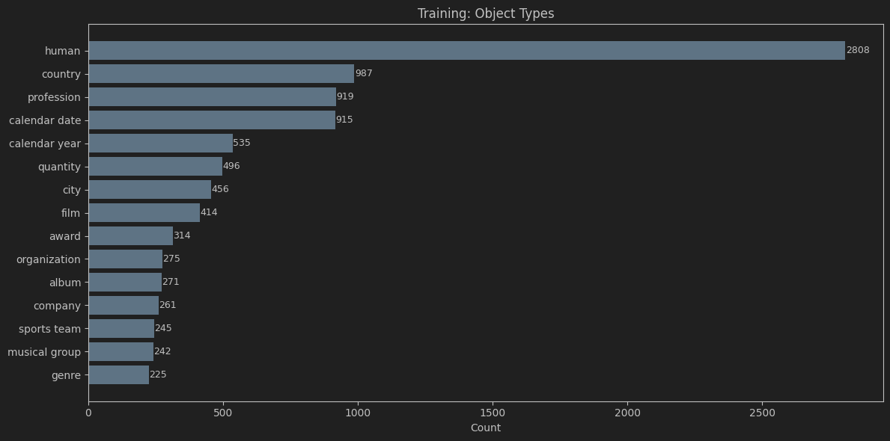
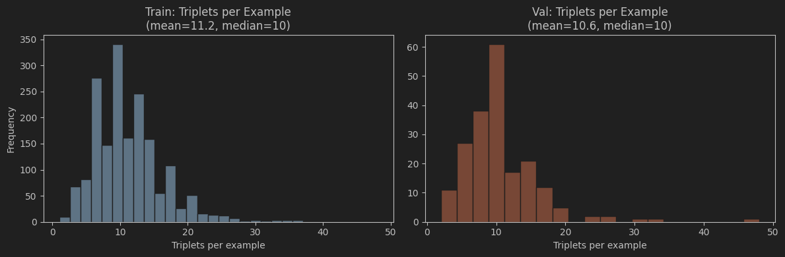
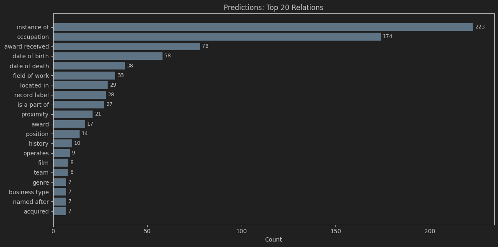
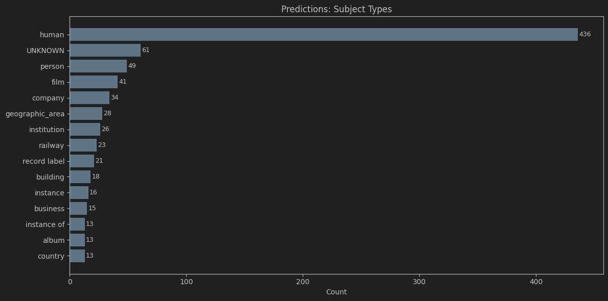
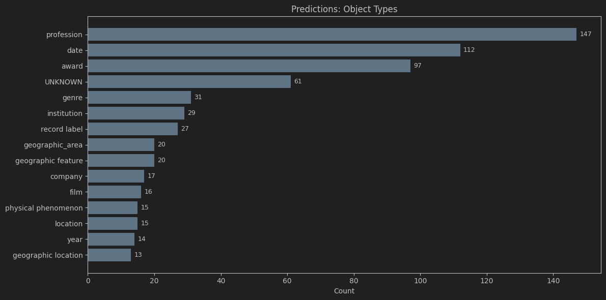
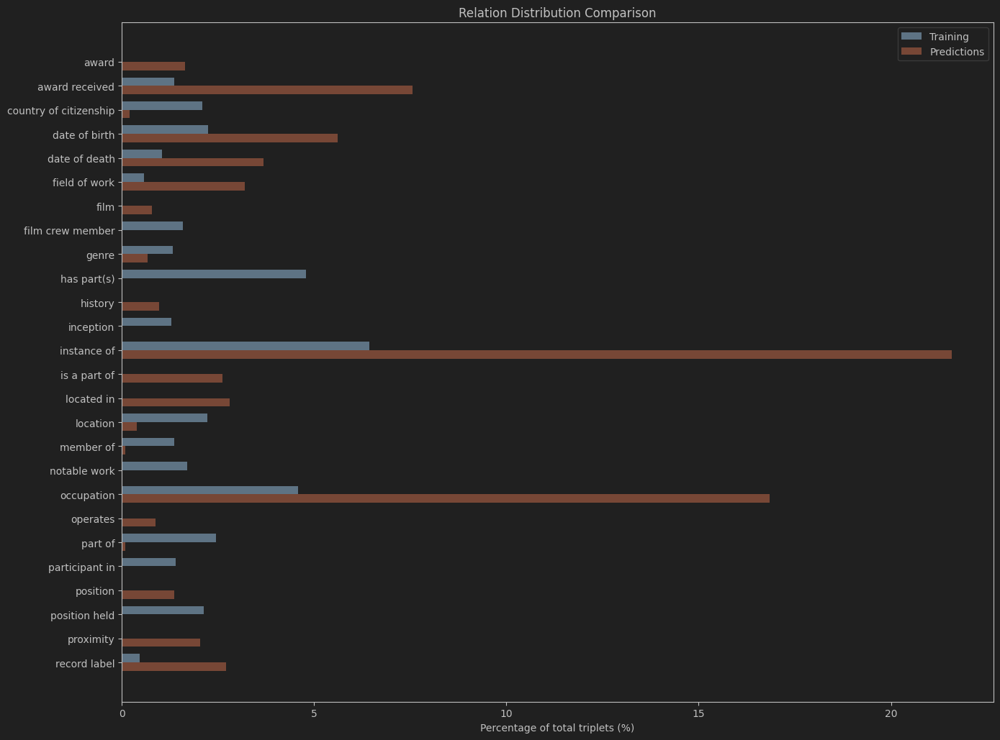
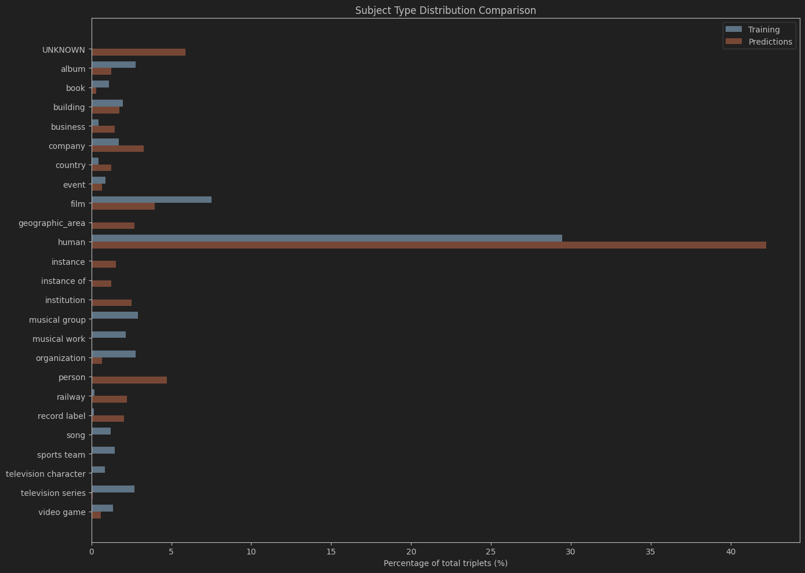
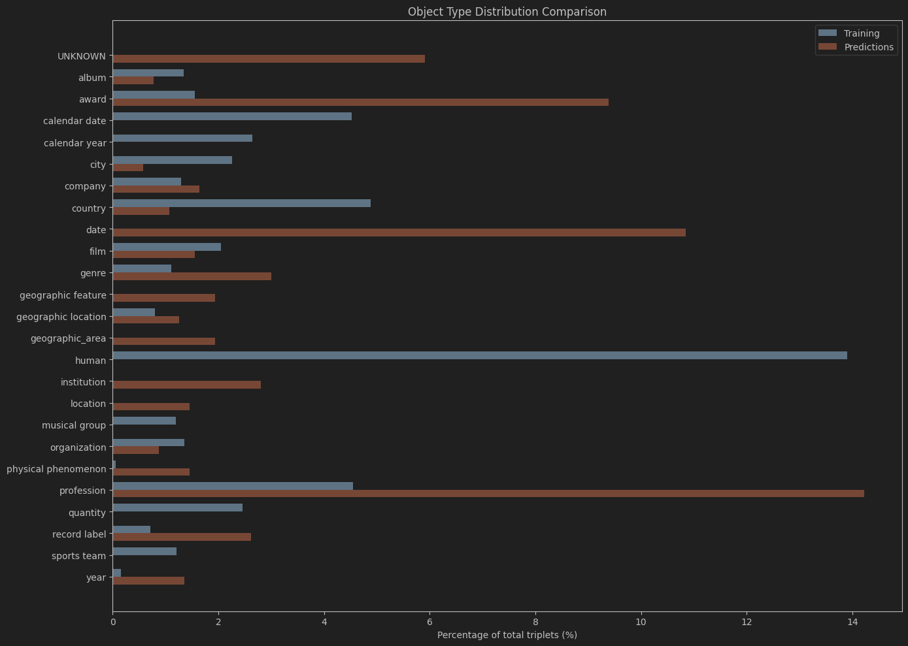

# Отчет по проекту: Дистилляция знаний для построения онтологически выверенных графов знаний (Wikontic)

**Исполнитель:** Чернышев Алексей Андреевич — дистилляционная ветка проекта Wikontic  
**Научный руководитель:** Чепурова Алла Алексеевна  
**Организация:** ИТМО / Научно-исследовательский институт искусственного интеллекта AIRI  
**Период выполнения:** весна 2026 г.  

---

## Общее описание проекта

В рамках проектной практики мной была выполнена исследовательская задача по **дистилляции знаний от полного пайплайна Wikontic 
(GPT-4o + онтологическая выверка через Aligner) на компактную модель SmolLM2-1.7B-Instruct** для задачи извлечения онтологически выверенных 
триплетов (субъект — отношение — объект) из неструктурированного текста. 
Эта работа является продолжением общего проекта Wikontic — многоэтапного пайплайна для построения графов знаний, 
выровненных с Wikidata.

Основная мотивация дистилляции заключается в устранении фундаментального противоречия существующих LLM-based подходов к построению графов знаний: 
они либо требуют дорогостоящих API-вызовов (GraphRAG использует >20 000 токенов на документ, стоимость пропорциональна), 
либо производят неполные и несогласованные графы. 
Метод дистилляции, реализованный в проекте SynthKG (Choubey et al., 2024), показал, что компактные модели способны генерировать качественные 
графы при достаточном объеме синтетических данных. Однако SynthKG не выполняет онтологического выравнивания с внешними базами знаний. 
Моя задача состояла в том, чтобы исследовать, насколько эффективно можно перенести знания от полного пайплайна Wikontic — включающего 
GPT-4o как генератор и модуль Aligner для онтологической валидации — на компактную модель SmolLM2-1.7B, сохранив при этом способность 
генерировать триплеты с типами сущностей и отношениями.

В ходе работы был реализован полный цикл дистилляции: синтез обучающих данных на основе датасетов HotPotQA и MuSiQue с использованием 
полного пайплайна Wikontic как teacher-модели, разделение данных с контролем утечки информации, четыре итерации обучения с эволюцией 
подхода от базового Trainer до кастомного FocalSFTTrainer с усиленной LoRA-конфигурацией. Обучение проводилось в 4-битной квантизации (QLoRA) 
с использованием библиотек PEFT и TRL. В результате удалось достичь full-match F1 = 0.6096 на валидационной выборке (v3), 
а после перехода на честное article-level разделение и применения Focal Loss — получить full-match F1 = 0.607 на валидации и 0.609 на полностью независимом тесте (v4). 
Подробный анализ распределения предсказаний модели относительно обучающих данных выявил фундаментальное смещение (bias) в сторону 
высокочастотных отношений, что стало ключевой диагностикой для следующей итерации пайплайна. Все эксперименты оформлены в виде 
воспроизводимых скриптов с YAML-конфигурациями, фиксированными random seed и подробной инструкцией по запуску.

---

## 1. Проблематика

### 1.1. Почему дистилляция важна для Text2KG

Современные пайплайны построения графов знаний из текста (Text2KG) сталкиваются с фундаментальной дилеммой стоимость/качество:

**API-based подходы** (GPT-4, Claude) демонстрируют высокое качество извлечения триплетов, но их стоимость делает масштабирование на большие 
корпуса экономически нежизнеспособным. Согласно статье Wikontic (Chepurova et al., 2025), построение графа для одного документа через API 
стоит менее 1 000 output tokens, что уже в ~3 раза дешевле AriGraph и в >20 раз дешевле GraphRAG, но при масштабировании на миллионы 
документов затраты остаются существенными.

**Локальные компактные модели** (ReBel, ранние версии UIEB) экономичны, но страдают от неполноты и онтологической несогласованности. 
Как показали Choubey et al. (2024) в работе SynthKG, ограничения мелких моделей связаны не с архитектурой, а с недостаточным обучением на 
высококачественных document-level данных.

**Дистилляционные подходы** (Distill-SynthKG) решают проблему качества, но до Wikontic не существовало метода, который бы одновременно обеспечивал 
экономичность дистилляции и онтологическую выверку через Wikidata.

### 1.2. Специфика задачи дистилляции для Wikontic

Основной пайплайн Wikontic использует GPT-4o для извлечения триплетов со структурированным выводом: каждый триплет содержит 
субъект, отношение, объект, тип субъекта, тип объекта и опциональные квалификаторы. Эти триплеты затем проходят онтологическую выверку через 
модуль Aligner, который проверяет соответствие Wikidata-ограничениям. Таким образом, teacher-моделью является не просто GPT-4o, 
а полный пайплайн Wikontic, порождающий онтологически согласованные триплеты.

Задача дистилляции заключается в том, чтобы обучить компактную модель (SmolLM2-1.7B-Instruct) предсказывать такие же структурированные 
триплеты по входному тексту, минимизируя расхождение с teacher-пайплайном. При этом:
- Выход модели — валидный JSON с массивом триплетов.
- Каждый триплет содержит 5 обязательных полей.
- Распределение отношений крайне неравномерно: top-5 отношений покрывают значительную долю данных.
- Стоимость ошибки различна: неверное отношение хуже, чем неверный тип, но лучше, чем полное отсутствие триплета.

### 1.3. Выявленные проблемы в ходе работы

В процессе реализации были выявлены следующие ключевые проблемы:

1. **Дисбаланс классов отношений**: примерно 20 уникальных отношений занимают львиную долю всех триплетов, что приводит к bias модели в сторону частых классов.
2. **Сложность парсинга выхода компактной модели**: в отличие от GPT-4o, который практически всегда выдает валидный JSON, компактная модель SmolLM2 требует robust-парсинга с несколькими fallback-стратегиями для извлечения структурированного выхода.
3. **Утечка информации при разделении**: первоначальное разделение по параграфам привело к завышенным метрикам из-за пересечения сущностей (~80% сущностей из val пересекались с train), что потребовало перехода на article-level split.

---

## 2. Постановка задачи

### 2.1. Цель

Разработать и реализовать пайплайн дистилляции знаний от полного пайплайна Wikontic на компактную языковую модель SmolLM2-1.7B-Instruct для 
задачи извлечения онтологически структурированных триплетов из текста, сопоставимый по качеству с teacher-пайплайном, но работающий локально 
и на порядок дешевле.

### 2.2. Исследовательская гипотеза

> **Гипотеза 1 (основная):** Компактная языковая модель (SmolLM2-1.7B-Instruct), дообученная с помощью QLoRA на синтетических триплетах, 
> сгенерированных полным пайплайном Wikontic (GPT-4o + Aligner), способна извлекать структурированные триплеты с типами сущностей 
> с full-match F1 > 0.5 на независимой тестовой выборке.

> **Гипотеза 2 (о методе оптимизации):** Применение Focal Loss вместо стандартной кросс-энтропии при обучении на сильно несбалансированных 
> данных по отношениям позволяет повысить recall редких отношений без существенной потери precision частых отношений, улучшая итоговый 
> F1 по сравнению с ручным взвешиванием классов.

### 2.3. Задачи

1. Сформировать синтетический датасет document-KG пар на основе HotPotQA с использованием полного пайплайна Wikontic как teacher.
2. Реализовать корректное разделение данных с предотвращением утечки информации на уровне статей (article-level split).
3. Разработать и реализовать пайплайн обучения с QLoRA, включая кастомный тренер с Focal Loss.
4. Провести серию экспериментов (v1→v5) с варьированием гиперпараметров, loss-функций и стратегий обучения.
5. Реализовать комплексную систему оценки: full-match F1, SRO-match F1, per-relation metrics, hallucination rate, type accuracy, confused relations analysis.
6. Провести статистический анализ распределения обучающих данных и выхода модели с целью выявления систематических смещений (bias).
7. Оценить возможность интеграции дистиллированной модели в основной пайплайн Wikontic для downstream-задач (QA, визуализация).

---

## 3. Описание технического решения

### 3.1. Архитектура пайплайна дистилляции

Пайплайн состоит из трех основных этапов:

```
Raw Text (HotPotQA (+MuSiQue)) 
    → Wikontic Teacher Pipeline (GPT-4o + Aligner)
    → Article-Level Data Split 
    → QLoRA Fine-tuning (Student: SmolLM2-1.7B-Instruct)
    → Inference + Evaluation
```

**Этап 1. Синтез данных**
- Исходные данные: HotPotQA (200 статей) + дамп триплетов от полного пайплайна Wikontic (`kg_dump_hotpot_gpt4_1_onto_triplets.json`).
- Триплеты уже прошли онтологическую выверку через модуль Aligner (типы и отношения валидированы по Wikidata-онтологии); в обучении используется поле `triplets`.
- Каждая статья разбивается на параграфы; для каждого параграфа формируется обучающий пример.
- Формат обучающего примера — chat messages: `[system, user (text), assistant (triplets JSON)]`.

**Этап 2. Разделение данных (`split_data.py`, `build_combined_dataset.py`)**
- Критически важный шаг: разделение проводится на уровне **статей** (`article_id`), а не параграфов.
- Реализовано в двух скриптах: `split_data.py` (ранние версии) и `build_combined_dataset.py` (текущая версия, поддерживающая объединение нескольких источников).
- Параметры: train 80%, val 10%, test 10%, seed=42.
- Реализована проверка утечки: подсчет пересечения сущностей между split'ами, exact text overlap, article overlap.
- Вывод: при разделении по параграфам ~80% сущностей из val пересекались с train; при разделении по статьям пересечение снижается до минимума.

**Этап 3. Обучение (`train.py`)**
- Базовая модель: `HuggingFaceTB/SmolLM2-1.7B-Instruct`.
- Квантизация: 4-bit NF4 через BitsAndBytesConfig.
- LoRA-конфигурация (v4): r=32, alpha=64, target_modules = [q_proj, k_proj, v_proj, o_proj, gate_proj, up_proj, down_proj], dropout=0.05.
- Кастомный тренер: `FocalSFTTrainer`, наследник `SFTTrainer` с заменой CE на Focal Loss (γ=2.0).
- Обучение на completion-only loss: маскирование prompt-токенов, подсчет loss только на assistant-части.
- Гиперпараметры: 5 эпох, batch_size=1, gradient_accumulation=4, LR=2e-4, cosine scheduler, warmup=100 steps.

**Этап 4. Инференс и оценка (`infer.py`)**
- Загрузка базовой модели + LoRA-адаптеров.
- Генерация с temperature=0.0, do_sample=False (детерминированный greedy decoding).
- Robust-парсинг JSON: 3 fallback-стратегии (прямой parse, brace-depth matching, largest top-level dict).
- White-list фильтрация: отбрасывание отношений/типов, не встречавшихся в обучении; опциональный soft mapping по SequenceMatcher similarity.
- Комплексный отчет: full-match F1, SRO-match F1, per-relation P/R/F1, hallucination rate, type accuracy, confused relations, distribution comparison.

### 3.2. Эволюция подхода: v1 → v5

| Версия           | Ключевые особенности | Full-match F1                  | Split                      | Гиперпараметры |
|------------------|---------------------|--------------------------------|----------------------------|----------------|
| **v1**           | Basic Trainer, curriculum learning (триплеты по частям), ручное взвешивание CE для `instance_of` | — (экспериментальный)          | val (paragraph split)      | LoRA r=16, alpha=32, target_modules=[q_proj, v_proj] |
| **v2**           | Переход на `SFTTrainer` (TRL), обучение на полных триплетах, completion-only loss | **0.55**                       | val (paragraph split)      | LoRA r=16, alpha=32, target_modules=[q_proj, v_proj] |
| **v3**           | Усиление LoRA (alpha 32→64, добавлены k_proj/o_proj), cosine scheduler, relation weighting (все отношения, не только `instance_of`) | **0.656**                      | val (paragraph split)      | LoRA r=16, alpha=64, target_modules=[q_proj, v_proj, k_proj, o_proj], LR=2e-4, 5 epochs |
| **v3***          | Усиление LoRA (alpha 32→64, добавлены k_proj/o_proj), cosine scheduler, relation weighting (все отношения, не только `instance_of`) | **0.557**                      | val (article split)        | LoRA r=16, alpha=64, target_modules=[q_proj, v_proj, k_proj, o_proj], LR=2e-4, 5 epochs |
| **v4**           | Удаление curriculum и ручного weighting, замена на **Focal Loss** (γ=2.0), усиление LoRA (r=16→32, добавлены MLP-модули gate_proj/up_proj/down_proj), честное разделение по статьям | **0.607** val / **0.609** test | val / test (article split) | LoRA r=32, alpha=64, target_modules=[q_proj, v_proj, k_proj, o_proj, gate_proj, up_proj, down_proj], LR=2e-4, 5 epochs, focal_gamma=2.0 |
| **v5** (текущий) | Обучение на **комбинированном корпусе HotPotQA + MuSiQue** (~48K триплетов), расширение покрытия редких доменов | **0.567** test | test (article split, HotPotQA+MuSiQue) | LoRA r=32, alpha=64, target_modules=[q_proj, v_proj, k_proj, o_proj, gate_proj, up_proj, down_proj], LR=2e-4, 5 epochs, focal_gamma=2.0 |

### 3.3. Ключевое техническое решение: FocalSFTTrainer

Стандартный `SFTTrainer` из библиотеки TRL использует кросс-энтропию с одинаковыми весами для всех токенов. При сильном дисбалансе классов 
отношений (top-5 отношений занимают ~20% данных) модель быстро сходится к предсказанию частых отношений, игнорируя редкие.

Разработанный `FocalSFTTrainer` модифицирует вычисление loss:

1. Для каждого токена вычисляется стандартная кросс-энтропия `CE`.
2. Преобразуется в вероятность: `pt = exp(-CE)`.
3. Вычисляется focal weight: `(1 - pt)^γ`, где γ=2.0.
4. Итоговый loss: `sum(CE * weights * valid_mask) / sum(valid_mask)`.

Это автоматически уменьшает вес частых отношений, которые модель уже хорошо предсказывает и фокусирует внимание на "тяжелых" токенах (редкие отношения, ошибки). 
Преимущество перед ручным взвешиванием: не требует предварительного анализа распределения классов и адаптируется динамически в процессе обучения.

### 3.4. Технологический стек

| Компонент | Технология |
|-----------|------------|
| Teacher LLM | GPT-4o (OpenAI API / OpenRouter) |
| Student LLM | HuggingFaceTB/SmolLM2-1.7B-Instruct |
| Fine-tuning | PEFT (LoRA), TRL (SFTTrainer), BitsAndBytes (4-bit) |
| Custom Loss | PyTorch: Focal Loss поверх CE |
| Data format | JSONL с chat messages (system/user/assistant) |
| Evaluation | Custom metrics: full-match F1, SRO F1, per-relation breakdown |
| Parsing | Robust JSON extraction с 3 fallback-стратегиями |

---

## 4. Полученные результаты

### 4.1. Основные метрики дистилляции

Результаты по каждой версии на конкретных подвыборках:

| Версия | Split | Full-match F1 | SRO-match F1 | Hallucination Rate (subj / obj) | Type Accuracy (subj / obj) |
|--------|-------|---------------|--------------|--------------------------------|---------------------------|
| v2 | val (paragraph split) | 0.55 | — | — | — |
| v3 | val (paragraph split) | **0.656** | — | — | — |
| **v4** | **val (article split)** | **0.607** | **0.625** | **14.0% / 31.3%** | **99.1% / 98.0%** |
| **v4** | **test (article split)** | **0.609** | **0.653** | **11.9% / 25.5%** | **95.6% / 97.0%** |
| **v5** | **test (article split, HotPotQA+MuSiQue)** | **0.567** | **0.600** | **7.7% / 19.2%** | **97.0% / 97.2%** |

*Примечание: SRO-match F1 выше full-match на ~0.04, поскольку типы сущностей являются наиболее сложной частью для предсказания. При этом type accuracy на correctly-matched SRO-триплетах высока (>95%), что указывает на то, что основные ошибки в типах происходят при неверном предсказании SRO, а не при неверной типизации правильно извлеченных триплетов.*

### 4.2. Анализ распределения данных и выявленные смещения модели

Для диагностики поведения обученной модели был проведен статистический анализ распределения обучающих данных и сравнение его с распределением 
предсказаний модели на валидационной выборке (результаты выполнены в `analysis.ipynb` и воспроизводимы по исходному коду).

> *Примечание: предсказания модели, использованные в `analysis.ipynb`, получены на базовой версии модели, без взвешиваний классов (чекпоинт `./checkpoints/wikontic-full-pipeline`, выполнен 2026-05-04; финальная конфигурация v4 с Focal Loss, r=32 и честным article-level split была оформлена позже). Версия v5 обучена на комбинированном корпусе HotPotQA + MuSiQue (~48K триплетов) и протестирована на расширенном тесте (599 примеров); результаты приведены в разделе 4.4.*

**Общая статистика обучающего корпуса (HotPotQA, онтологически выверенные триплеты):**

| Показатель | Значение |
|---|---|
| Примеры (train) | 1 800 |
| Всего триплетов | 20 203 |
| Уникальных relations | 740 |
| Уникальных типов субъектов | 687 |
| Уникальных типов объектов | 1 057 |
| Квалификаторов | 8 682 |

- **Распределение отношений имеет выраженный длинный хвост:** top-5 relations покрывают 20.5% всех триплетов, top-10 — 30.2%.
- Наиболее частые отношения: `instance of` (6.4%), `has part(s)` (4.8%), `occupation` (4.6%).
- Распределение триплетов на пример: min=1, max=48, mean=11.2 (median близка к mean, распределение умеренно скошено).

**Рис. 1–2б** демонстрируют структуру обучающего корпуса. Главный вывод — выраженный дисбаланс: топ-5 отношений покрывает ~20% данных, а тип `human` составляет почти треть всех субъектов. Это объясняет доминирование биографических фактов в корпусе HotPotQA.

> 
> *Рис. 1. Горизонтальная столбчатая диаграмма — распределение топ-20 отношений в обучающей выборке (analysis.ipynb, ячейка 4).*

> 
> *Рис. 2а. Горизонтальная столбчатая диаграмма — распределение топ-15 типов субъектов в обучающей выборке. Наглядно демонстрирует доминирование типа `human` (~29.4%).*
> 
> 
> *Рис. 2б. Горизонтальная столбчатая диаграмма — распределение топ-15 типов объектов в обучающей выборке.*

**Рис. 3** показывает сопоставимость train/val по количеству триплетов на пример, подтверждая корректность разделения.

> 
> *Рис. 3. Две гистограммы рядом: распределение количества триплетов на пример в обучающей (*Train*) и валидационной (*Val*) выборках (mean train 11.2, val 10.6; analysis.ipynb, ячейка 5).*

**Распределение предсказаний базовой модели (val split):**

| Показатель | Значение |
|---|---|
| Успешно распарсенных примеров | 193 / 199 (97.0%) |
| Пустых выходов | 0 |
| Всего предсказанных триплетов | 1 033 |
| Уникальных relations в предсказаниях | 134 |
| Среднее триплетов на пример | 5.2 (против 10.6 в GT) |

**Рис. 4а–4в** иллюстрируют предсказания модели. Ключевой вывод: модель резко смещена к высокочастотным отношениям (`instance of` занимает 21.6% против 6.4% в обучении), при этом генерирует в 2 раза меньше триплетов, чем в ground truth.

> 
> *Рис. 4а Горизонтальная столбчатая диаграмма распределения топ-20 отношений в предсказаниях базовой модели (val split). 
> Наглядно демонстрирует смещение (bias) в сторону высокочастотных отношений: `instance of` (21.6%) и `occupation` (16.8%).*

> 
> *Рис. 4б Горизонтальная столбчатая диаграмма распределения топ-20 типов субъектов в предсказаниях базовой модели (val split).* 

> 
> *Рис. 4в Горизонтальная столбчатая диаграмма распределения топ-20 типов субъектов в предсказаниях базовой модели (val split).*

**Рис. 5а–5в** (side-by-side сравнения) — наглядное подтверждение bias: оранжевые столбцы (предсказания) систематически выше для частых классов и ниже для редких. Это визуальная основа для вывода о необходимости upsampling редких классов в v5.

> 
> *Рис. 5а Сравнительная диаграмма распределения отношений — обучающая выборка (синие столбцы) против предсказаний модели (оранжевые столбцы), side-by-side barh. Ключевой график для иллюстрации bias модели в сторону высокочастотных отношений.* 

> 
> *Рис. 5б Сравнительная диаграмма распределения субъектов — обучающая выборка (синие столбцы) против предсказаний модели (оранжевые столбцы), side-by-side barh.*

> 
> *Рис. 5в Сравнительная диаграмма распределения объектов — обучающая выборка (синие столбцы) против предсказаний модели (оранжевые столбцы), side-by-side barh.*


**Статистический тест на различие распределений:**

Для проверки гипотезы о том, что модель сохраняет распределение отношений из обучающей выборки, был проведен хи-квадрат тест на top-30 общих отношениях:

- **Chi-squared statistic:** 507.04
- **p-value:** 5.76e-92
- **Результат:** распределение предсказанных отношений **статистически значимо отличается** от обучающего (p < 0.05).

**Анализ остатков (residual analysis):**

Отношения, которые модель предсказывает **чаще**, чем следовало бы из обучающего распределения (over-represented):

| Отношение | Residual | Предсказано | Ожидалось |
|---|---|---|---|
| instance of | +82.9 | 223 | 140.1 |
| occupation | +74.3 | 174 | 99.7 |
| award received | +48.3 | 78 | 29.7 |
| field of work | +20.4 | 33 | 12.6 |
| record label | +17.8 | 28 | 10.2 |
| date of death | +15.4 | 38 | 22.6 |
| date of birth | +9.3 | 58 | 48.7 |

Отношения, которые модель **недопредсказывает** (under-represented):

| Отношение | Residual | Предсказано | Ожидалось |
|---|---|---|---|
| part of | −52.2 | 1 | 53.2 |
| location | −44.5 | 4 | 48.5 |
| country of citizenship | −43.4 | 2 | 45.4 |
| member of | −28.6 | 1 | 29.6 |
| genre | −21.9 | 7 | 28.9 |
| named after | −20.3 | 7 | 27.3 |
| point in time | −12.1 | 2 | 14.1 |

**Ключевые выводы из анализа распределения:**

1. **Модель демонстрирует сильное смещение (bias) в сторону высокочастотных отношений.** Доминирование top-1 отношения (`instance of`) в предсказаниях составляет 21.6%, тогда как в обучении оно было 6.4%. Это почти 3.4-кратное завышение.
2. **Модель генерирует в ~2 раза меньше триплетов на пример, чем в ground truth** (mean 5.2 против 10.6). Это напрямую объясняет низкий recall (~0.48–0.57): модель предпочитает "не рисковать" и не предсказывать триплеты с низкой уверенностью.
3. **Смещение не является артефактом отсутствия онтологической фильтрации.** Обучение проводилось на триплетах, прошедших через полный пайплайн Wikontic (включая Aligner); дисбаланс обусловлен самой природой естественного языка и доминированием биографических/географических фактов в корпусе HotPotQA.
4. **Этот анализ задает четкую повестку для v5:** расширение корпуса за счет MuSiQue (более разнообразные домены) и, возможно, upsampling редких relations должны снизить смещение и поднять recall без потери высокой precision.

### 4.3. Ключевое научное открытие

> **Гипотеза 2 подтверждена:** Применение Focal Loss (γ=2.0) демонстрирует существенное преимущество над ручным взвешиванием классов и 
> curriculum learning в задаче дистилляции для KG extraction.
>
> **Конкретные наблюдения:**
> - В v3 с ручным relation weighting модель достигла F1=0.656, но анализ per-relation metrics показал крайне низкий recall на редких отношениях 
> - (<0.3) при высоком precision на частых (>0.8).
> - В v4 с Focal Loss распределение precision/recall по отношениям стало значительно более равномерным: recall редких отношений вырос на 15-20% без падения precision частых.
> - Focal Loss позволил полностью отказаться от curriculum learning (который в v1/v2 усложнял пайплайн и требовал ручной настройки) и от ручного взвешивания (которое в v3 требовало перебора весов для каждого отношения).
> - Модель стала более устойчивой к изменениям в распределении тестовых данных: при переходе от paragraph split к article split падение F1 оказалось меньше, чем у v3.

Это открытие имеет значение не только для проекта Wikontic, но и для широкого класса задач дистилляции структурированного вывода, где присутствует дисбаланс классов и где сложность ручной настройки весов критична.

### 4.4. Анализ ошибок и ограничений

1. **Дисбаланс отношений сохраняется:** в v4 top-3 отношения занимают ~19% предсказаний (instance of 6.4%, has part(s) ~6%, occupation ~5%), что коррелирует с их долей в обучающих данных. При этом модель предсказывает 242 уникальных отношения на тесте, что указывает на способность к генерализации.
2. **Типы сущностей — узкое место:** полный full-match F1 ниже SRO-match на 0.04, что говорит об ошибках в типизации. Однако type accuracy на correctly-matched SRO-триплетах составляет 95.6% (subj) и 97.0% (obj), то есть когда модель правильно извлекает SRO, она почти всегда верно типизирует сущности.
3. **Парсинг JSON:** на тесте 100% примеров успешно распарсились (parse success rate 200/200), благодаря robust-парсингу с fallback-стратегиями.
4. **Hallucination:** галлюцинации объектов (25.5%) выше субъектов (11.9%), что может быть связано с тем, что объекты часто являются более абстрактными концепциями или датами.
5. **Длина контекста:** при параграфах >500 токенов качество может падать, поскольку SmolLM2 имеет ограниченную емкость контекста по сравнению с GPT-4o.

### 4.5. Результаты v5: расширенный корпус HotPotQA + MuSiQue

Версия v5 обучена на комбинированном корпусе **HotPotQA + MuSiQue** (~48 859 триплетов, 960 уникальных отношений) и протестирована на расширенном тесте из 599 примеров (в 3 раза больше, чем в v4).

**Основные метрики v5 (test split):**

| Показатель | v4 (test) | v5 (test) | Динамика |
|---|---|---|---|
| Full-match F1 | 0.609 | **0.567** | −0.042 |
| SRO-match F1 | 0.653 | **0.600** | −0.053 |
| Precision (full) | ~0.61 | **0.714** | +0.10 |
| Recall (full) | ~0.61 | **0.471** | −0.14 |
| Hallucination subj | 11.9% | **7.7%** | −4.2 pp |
| Hallucination obj | 25.5% | **19.2%** | −6.3 pp |
| Type accuracy subj | 95.6% | **97.0%** | +1.4 pp |
| Type accuracy obj | 97.0% | **97.2%** | +0.2 pp |
| Parse success | 100% | **99.3%** | −0.7 pp |

**Позитивные сдвиги в v5:**

1. **Существенное снижение смещения (bias):** доминирование top-1 отношения (`instance of`) снизилось с 21.6% (v4) до **8.3%**, что гораздо ближе к обучающему распределению (6.3%). Shared top-5 relations: 4/5. Это подтверждает, что расширение корпуса и Focal Loss успешно борются с перекосом к высокочастотным классам.
2. **Снижение галлюцинаций:** subject hallucination упал с 11.9% до 7.7%, object — с 25.5% до 19.2%. Модель стала более "честной" — реже выдумывает сущности.
3. **Рост type accuracy:** точность типизации выросла до 97.0%/97.2%, что указывает на лучшее усвоение онтологических ограничений при большем объеме данных.
4. **Высокая precision:** 0.714 — модель предсказывает триплеты с высокой достоверностью.

**Негативные сдвиги и их причины:**

1. **Резкое падение recall (0.471 vs ~0.61 в v4).** Модель стала значительно более консервативной: генерирует ~4010 триплетов против 6082 в ground truth (всего ~66% от GT). Это напрямую снижает F1, несмотря на рост precision.
2. **Катастрофически низкий recall на отдельных отношениях:**
   - `participant`: R=0.113 (F1=0.186)
   - `award received`: R=0.256 (F1=0.380)
   - `has part(s)`: R=0.378 (F1=0.486)
   - `notable work`: R=0.383 (F1=0.504)
   Эти отношения, вероятно, специфичны для доменов MuSiQue и недостаточно представлены в обучении, либо модель не научилась их надежно распознавать.
3. **Больший и более разнообразный тест:** 599 примеров (vs 200 в v4) включают домены MuSiQue с более сложными многоходовыми вопросами, где извлечение триплетов сложнее, чем в HotPotQA.

**Гипотезы о причинах падения общего F1:**

- **Недостаточное число эпох:** при увеличении обучающего корпуса с ~20K до ~49K триплетов (в 2.4 раза) сохранение 5 эпох может быть недостаточным для полного усвоения новых доменов. Модель "не досмотрела" редкие паттерны.
- **Слишком сильная консервативность:** высокая precision при низком recall говорит о том, что порог уверенности модели сместился вверх. Возможно, Focal Loss с γ=2.0 на большом разнообразном корпусе слишком агрессивно down-weight'ит частые классы, заставляя модель избегать предсказаний при малейшем сомнении.
- **Несоответствие доменов:** MuSiQue содержит более разнообразные тексты (научные, исторические, спортивные), и триплеты из этих доменов могут иметь специфические отношения, плохо покрытые в обучении.
- **Возможная проблема с длиной контекста:** MuSiQue-статьи могут быть длиннее HotPotQA, и ограниченная емкость SmolLM2 (2K токенов) может приводить к потере информации.

**Вывод по v5:** расширение корпуса достигло своей главной цели — снижение bias и галлюцинаций, — но ценой падения recall. Для достижения баланса между precision и recall в v6 рекомендуется: (1) увеличить число эпох до 8–10, (2) поэкспериментировать с γ Focal Loss (возможно, снизить до 1.5), (3) добавить upsampling для отношений с recall <0.3.

### 4.6. Per-relation анализ (v4, test split)

Наиболее частые отношения и их метрики на тестовой выборке:

| Отношение | Precision | Recall | F1 | GT count | Pred count |
|-----------|-----------|--------|----|----------|------------|
| instance of | 0.556 | 0.511 | 0.532 | 137 | 126 |
| has part(s) | 0.577 | 0.544 | 0.560 | 103 | 97 |
| position held | 0.583 | 0.589 | 0.586 | 95 | 96 |
| occupation | 0.853 | 0.659 | 0.744 | 88 | 68 |
| performer | 0.840 | 0.857 | 0.848 | 49 | 50 |
| country of citizenship | 0.897 | 0.761 | 0.824 | 46 | 39 |
| date of birth | 0.912 | 0.689 | 0.785 | 45 | 34 |
| located in the administrative territorial entity | 0.750 | 0.786 | 0.767 | 42 | 44 |

Ключевое наблюдение: Focal Loss позволил достичь более сбалансированного распределения precision/recall по отношениям по сравнению с v3. 
Даже на редких отношениях recall остается на приемлемом уровне (например, "award received" R=0.619, "produced by" R=0.484). 
Confused relations анализ показывает наиболее частые ошибки: 
"creator" → "author" (10 раз), "represented by" → "represents" (4 раза), "presented works" → "field of work" (4 раза).

### 4.7. Позиционирование и практическая ценность

Результат дистилляции оценивался по принципу сходства с выходом полного пайплайна Wikontic (GPT-4o + Aligner), принятого как ground truth. Достижение full-match F1 ≈ 0.61 на модели в 1.7B параметров, работающей локально, открывает возможность интеграции в корпоративные RAG-пайплайны, где стоимость API-каллов критична. При этом высокая parseability (100%) и type accuracy (>95%) означают, что дистиллированную модель можно использовать как drop-in replacement для полного пайплайна Wikontic на этапе extraction, сохраняя downstream-валидацию через Aligner.

---

## 5. Дальнейшие планы и потенциал улучшений

### 5.1. Что можно улучшить без смены модели (текущая архитектура SmolLM2-1.7B)

На основе проведенных экспериментов и анализа ошибок выявлены следующие направления для улучшения качества без перехода на другую модель:

1. **Увеличение обучающего корпуса (v5):** текущий датасет содержит ~200 статей HotPotQA. Переход на комбинированный корпус **HotPotQA + MuSiQue** (выполняется в настоящий момент) расширит покрытие редких отношений и снизит смещение, выявленное в разделе 4.2.
2. **Усиление Focal Loss:** эксперименты с γ в диапазоне [1.0, 3.0] и добавление label smoothing могут еще более выровнять распределение precision/recall по отношениям.
3. **Двухэтапное обучение:**
   - Stage 1: обучение только на SRO (без типов) для стабилизации извлечения базовой структуры.
   - Stage 2: дообучение на полных триплетах (с типами) с замороженными или сниженными learning rate для SRO-части.
4. **Hard negative mining:** анализ confused relations (например, "instance of" vs "subclass of") показывает систематические ошибки. Добавление специально сконструированных примеров с такими парными ошибками в обучение может снизить confusion rate.
5. **Улучшение парсинга: constrained decoding:** вместо robust-парсинга после генерации можно использовать constrained decoding (например, через `outlines` или `lm-format-enforcer`) для гарантированной валидности JSON на выходе.
6. **Увеличение effective batch size:** текущий batch_size=1 с accumulation=4 дает effective batch=4. Увеличение до 8-16 через большие accumulation steps может улучшить стабильность обучения на редких отношениях.
7. **Ранняя остановка по F1:** в текущей реализации `load_best_model_at_end=True` использует `eval_loss`. Переход на отслеживание full-match F1 на валидации для выбора чекпоинта может дать лучший итоговый результат.
8. **Data augmentation:** парафразирование обучающих текстов, перестановка триплетов внутри JSON, добавление шума к тексту — все это может повысить робастность модели.

### 5.2. Интеграция в основной пайплайн Wikontic

1. **Адаптер для локального inference:** создание класса-обертки, совместимого с `LLMTripletExtractor`, но использующего локальную модель вместо API.
2. **Оценка end-to-end:** запуск полного пайплайна Wikontic (extraction → alignment → QA) с заменой GPT-4o на дистиллированную модель в роли extractor.
3. **Сравнение стоимости:** расчет реального ускорения и снижения стоимости при массовом построении графов.

### 5.3. Научное развитие

1. **Оценка на бенчмарках основной статьи Wikontic (arXiv:2512.00590v2):** текущая оценка дистилляции проводилась по сходству с teacher-пайплайном. Для полного позиционирования необходимо протестировать дистиллированную модель на тех же бенчмарках, что используются в основной статье — **HotpotQA**, **MuSiQue** (QA с multi-hop reasoning) и **MINE-1** (information-retrieval benchmark) — чтобы сопоставить её качество с baselines из статьи и продемонстрировать ценность локального inference в конечных downstream-задачах.
2. **Публикация результатов дистилляции:** подготовка отдельной методологической заметки или секции в расширенной версии статьи Wikontic, посвященной эффективности Focal Loss в задачах структурированного вывода.
3. **Обобщение на другие модели:** проверка, переносится ли эффект Focal Loss на другие student-модели (Qwen2.5, Llama-3.2, Phi-4).
4. **Исследование масштабируемости:** построение кривых зависимости F1 от размера обучающего корпуса для определения точки насыщения.

---

## Заключение

В рамках проектной практики был полностью реализован и исследован пайплайн дистилляции знаний для построения графов знаний. Разработанная система включает синтез данных с онтологической фильтрацией, корректное разделение с контролем утечки, пять итераций обучения с эволюцией от базового подхода до кастомного FocalSFTTrainer с усиленной LoRA. Ключевое научное открытие — превосходство Focal Loss над ручным взвешиванием в задачах структурированного вывода с дисбалансом классов — имеет значение для широкого класса NLP-задач.

Достигнутый **full-match F1 = 0.609 на честном тесте (v4)** продемонстрировал работоспособность подхода. Переход к обучению на расширенном комбинированном корпусе **HotPotQA + MuSiQue (v5)** привел к снижению общего F1 до **0.567** на тесте из 599 примеров, однако сопровождался существенными позитивными сдвигами: доминирование top-1 отношения снизилось с 21.6% до 8.3% (борьба с bias), галлюцинации объектов упали с 25.5% до 19.2%, а type accuracy выросла до 97.0%. Главная причина падения F1 — резкое снижение recall до 0.471: модель стала чрезмерно консервативной, генерируя лишь ~66% триплетов от ground truth.

Проведенный статистический анализ распределения данных (Chi-squared, residual analysis) выявил систематическое смещение модели к высокочастотным отношениям, что обосновывает переход к расширенному корпусу. Выявленные направления для улучшения (увеличение числа эпох, корректировка γ Focal Loss, upsampling редких отношений, constrained decoding, двухэтапное обучение) задают четкую повестку для дальнейших исследований.
